# Assignment 1: Rendering Basics with PyTorch3D (Total: 100 Points + 10 Bonus)

**Name:** Riu Cherdchusakulchai
**Andrew ID:** rcherdch

---

## 1. Practicing with Cameras (15 Points)

### 1.1. 360-degree Renders (5 points)

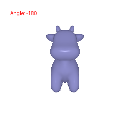

### 1.2 Re-creating the Dolly Zoom (10 points)

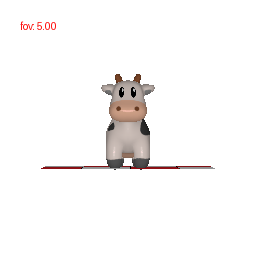

## 2. Practicing with Meshes (10 Points)

### 2.1 Constructing a Tetrahedron (5 points)

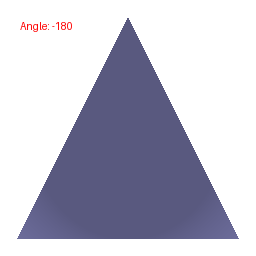

### 2.2 Constructing a Cube (5 points)

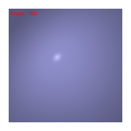

## 3. Re-texturing a mesh (10 points)

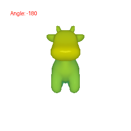

I choose yellow (color1 = [1,1,0]) and cyan (color2 = [0,1,1]) to re-texture the mesh.

## 4. Camera Transformations (10 points)

### 1. Rotate camera by 90° around the z-axis

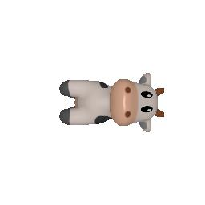

### 2. Move camera 2 units away from the cow along the z-axis

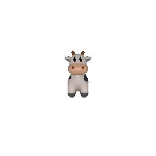

### 3. Move camera 1 units along the x-axis

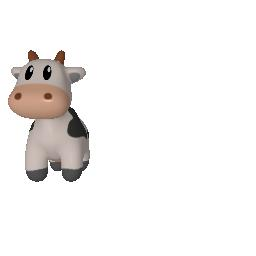

### 4. Rotate camera by -90° around the y-axis and then move -3 units along the x-axis and 3 units along the z-axis

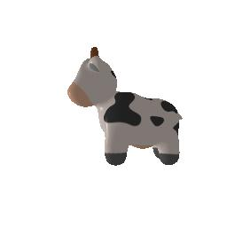

## 5. Rendering Generic 3D Representations (45 Points)

### 5.1 Rendering Point Clouds from RGB-D Images (10 points)

#### 1. The point cloud corresponding to the first image
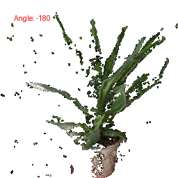

#### 2. The point cloud corresponding to the second image
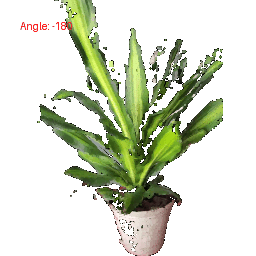

#### 3. The point cloud formed by the union of the first 2 point clouds.
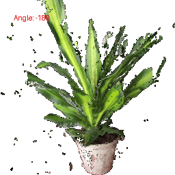

### 5.2 Parametric Functions (10 + 5 points)

#### 1. Torus
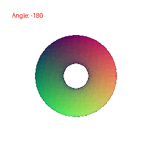

#### 1. Klein Bottle
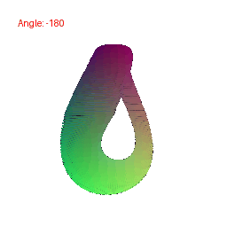

### 5.3 Implicit Surfaces (15 + 5 points)

#### 1. Torus
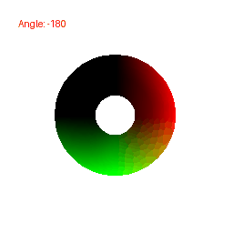

### 2. Tradeoffs between rendering as a mesh vs a point cloud

Point clouds offer high accuracy because they capture the precise 3D coordinates of each measured point, but they can be hard to render and manage due to their large size and unstructured nature. Conversely, meshes are far more efficient for rendering and easier to manipulate. Meshes also can be textured and shaded, resulting in a more realistic representation.

### 3. Gyroid
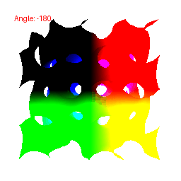

## 6. Do Something Fun (10 points)

I downloaded the human mesh model from Free3D. I applied textures to the mesh and rendered the object from different angles, with varying fields of view (FOV), and at different distances along the camera path.

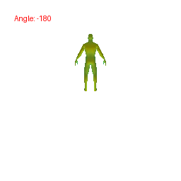

## (Extra Credit) 7. Sampling Points on Meshes (10 points)

Renders of a point cloud: The image shows a cow mesh, with its point cloud randomly sampled at 10, 100, 1,000, and 10,000 points. The original cow mesh is on the far right.

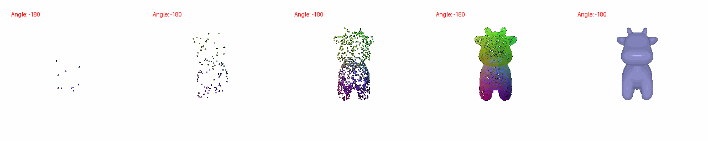

