# Assignment 2: Single View to 3D

**Name:** Riu Cherdchusakulchai
**Andrew ID:** rcherdch

---

## 1. Exploring loss functions

### 1.1. Fitting a voxel grid (5 points)

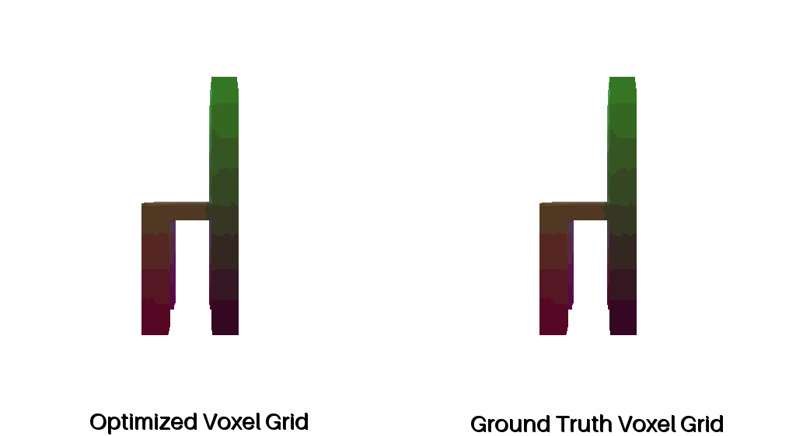

### 1.2. Fitting a point cloud (5 points)

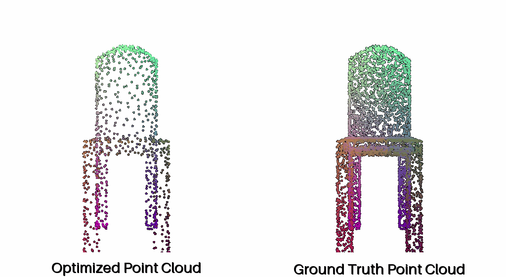

### 1.3. Fitting a mesh (5 points)

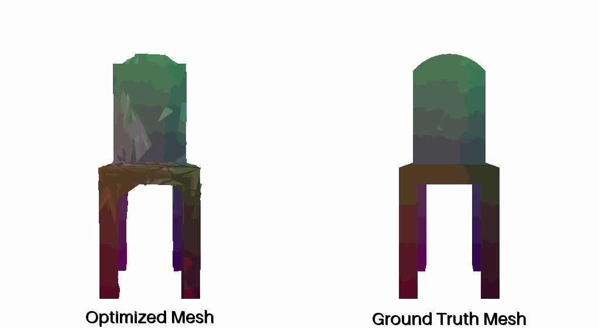

## 2. Reconstructing 3D from single view

### 2.1. Image to voxel grid (20 points)

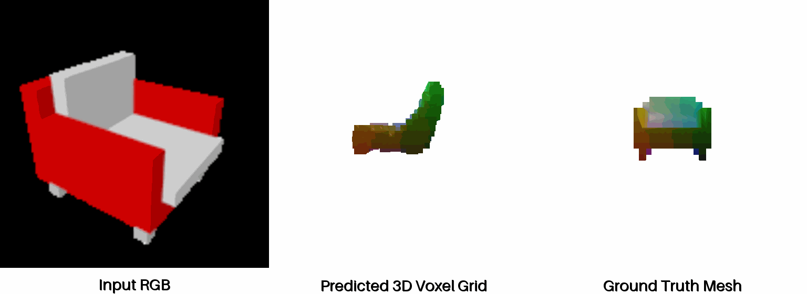
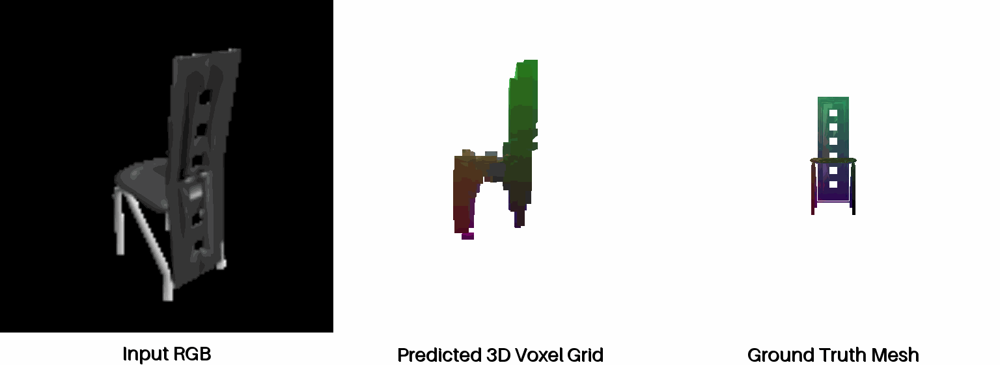
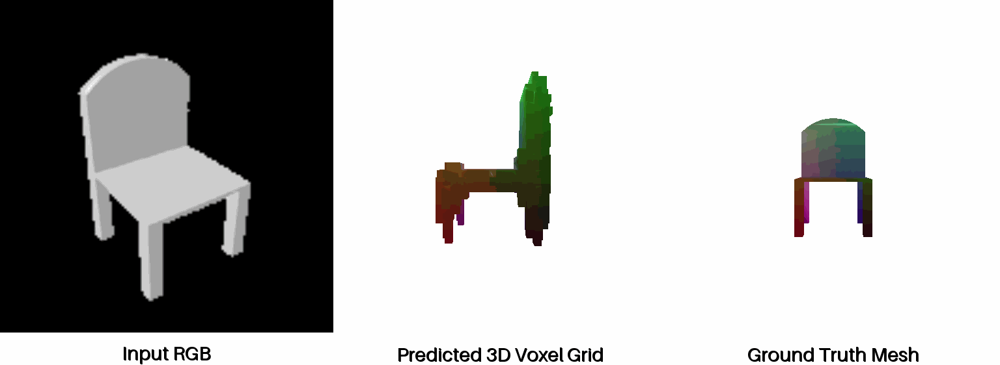

### 2.2. Image to point cloud (20 points)

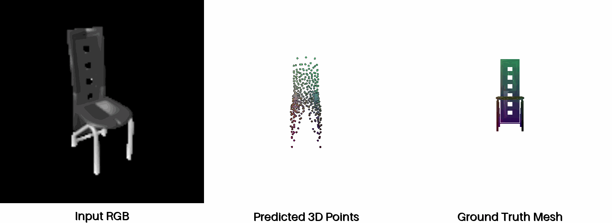
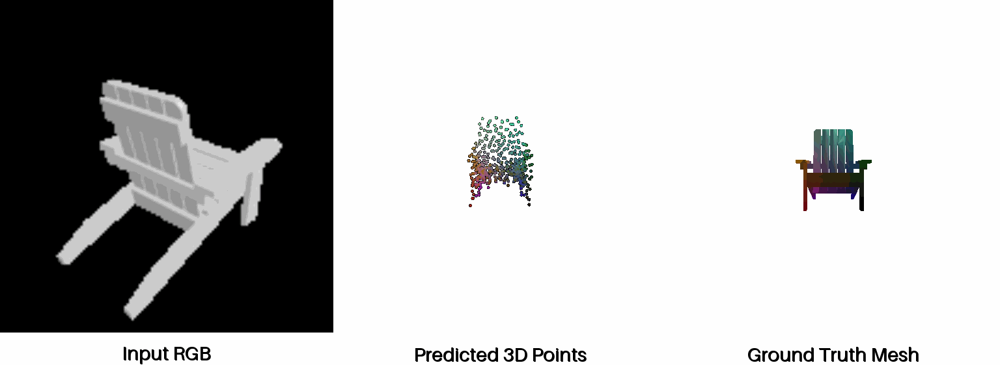
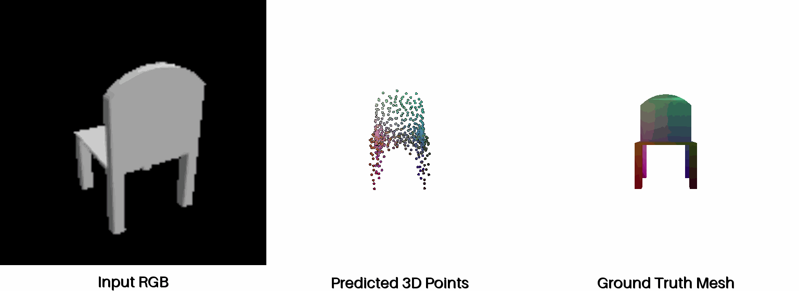

### 2.3. Image to mesh (20 points)

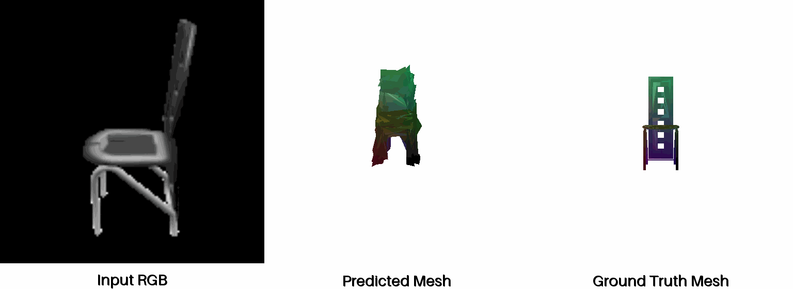
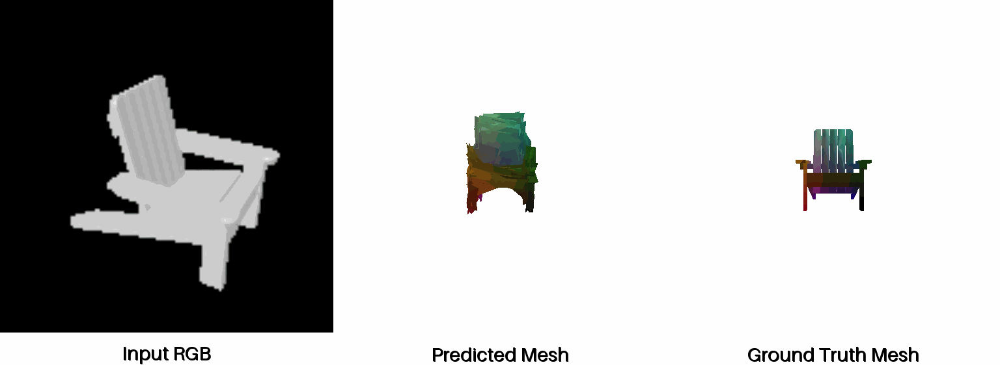
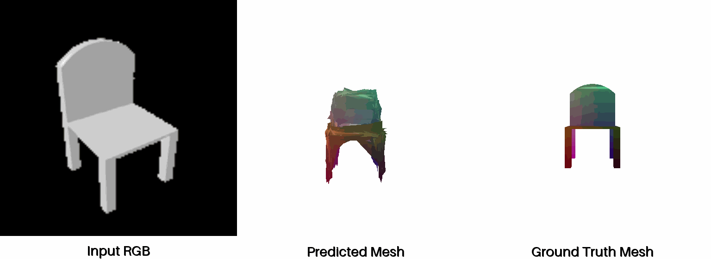

### 2.4. Quantitative comparisions(10 points)

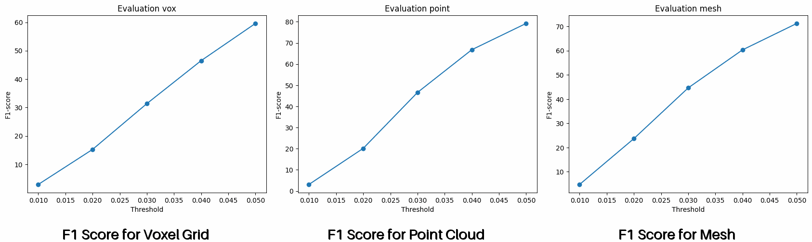

Quantitatively, at the threshold of 0.050, the Point Cloud decoder yields the highest F1-score (≈80), followed by the Mesh decoder (≈72), with the Voxel Grid decoder showing the lowest score (≈59). This is intuitively justified by the flexibility and constraints of the representation. The Point Cloud is the least constrained, only needing to position individual points near the surface, allowing it to achieve the best match under a relaxed threshold. The Mesh is more constrained by the requirement of connectivity and a coherent surface topology. Also, starting the mesh decoder from a simple shape like sphere requires the neural network to perform too complex geometric transform and topological changes. The Voxel Grid is the most constrained representation due to its output being fixed to a finite resolution, which imposes a limit the score it can achieve relative to a continuous ground-truth surface, resulting in the lowest peak F1-score.

### 2.5. Analyse effects of hyperparams variations (10 points)

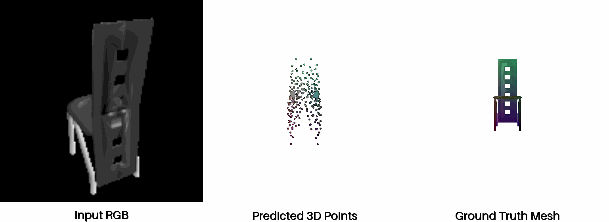

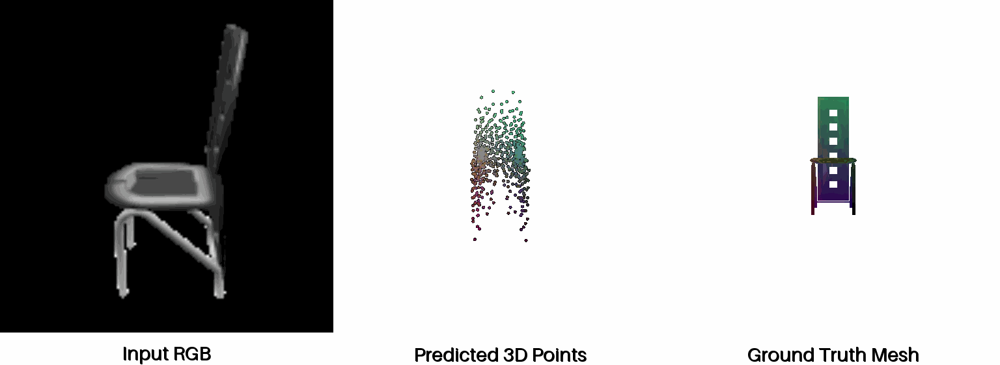
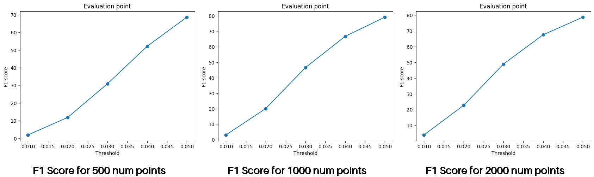

This analysis shows that increasing the number of points significantly boosts the F1-score, rising from ≈68 (500 points) to ≈80 (1000 points) at the 0.050 threshold. However, this performance gain saturates, as adding even more points (2000) offers not much further improvement, indicating that 1000 points provides sufficient resolution for this dataset.

### 2.6. Interpret your model (15 points)

In this part, I try to interpret the voxel decoder model by extracting the cube feature map in the hidden layers, taking the average across all the channels, and normalizing it. I then convert this feature map to a voxel grid for visualization. Thus, in each layer, it is evolving into the object we want to predict.

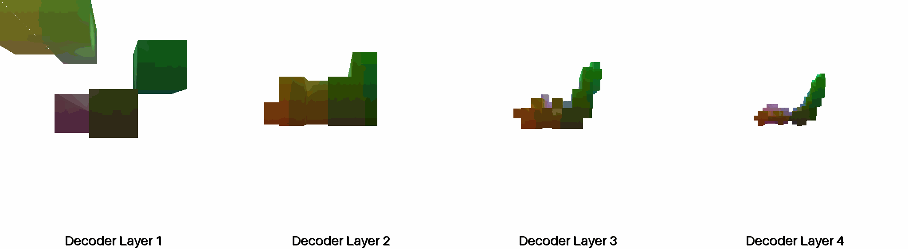

## 3. Exploring other architectures / datasets. (Choose at least one! More than one is extra credit)

### 3.1 Implicit network (10 points)

I implemented an implicit decoder that takes in as input 3D locations and outputs the occupancy value. However, the model was not working.

### 3.2 Parametric network (10 points)

I implemented a parametric decoder designed to generate a 3D point cloud from a conditioning feature vector. The core idea is to learn a continuous mapping from a simple 2D parametric domain (a square) to the complex 3D surface of an object. I used a simple MLP for the decoder. A final Tanh activation was used to ensure the output coordinates are bounded within a normalized space. The result shows that at the threshold of 0.050, this parametric decoder yields the F1-score of around 80.

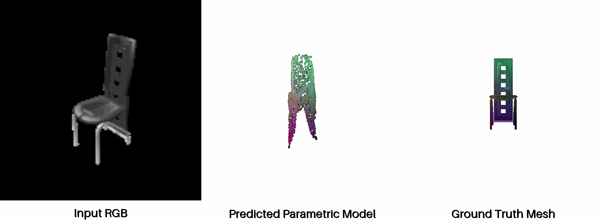
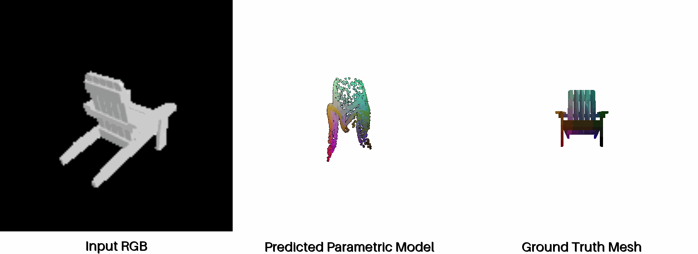
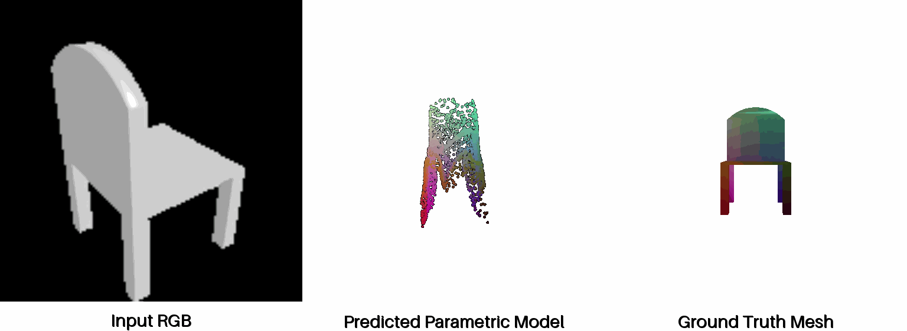
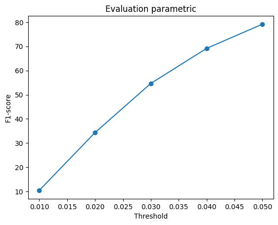

### 3.3 Extended dataset for training (10 points)

I trained the 3D reconstruction point cloud model on an extended dataset containing three classes. The results show that the predicted point cloud from the three-class model has a better qualitative result. For instance, in the first example, we can see that the model can predict the legs of the chair, but the predicted point cloud from the one-class model cannot. As for the quantitative result, the graph shows that the three-class model has a better F1 score (≈83), compared to the one-class model (≈80).

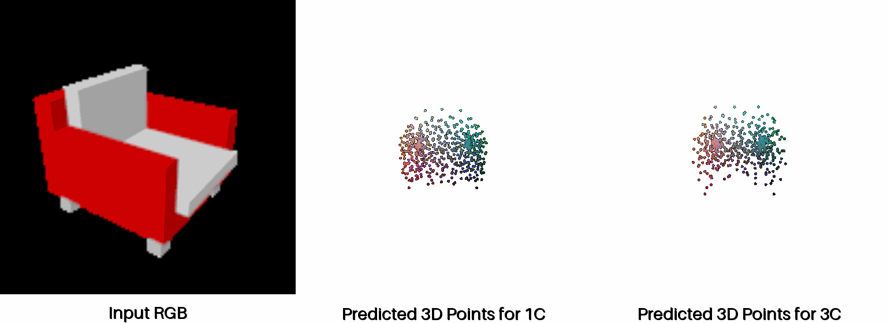
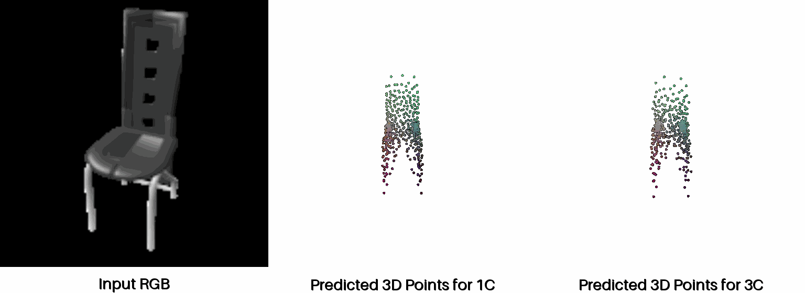
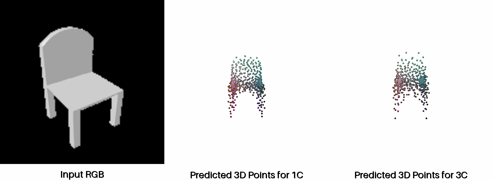

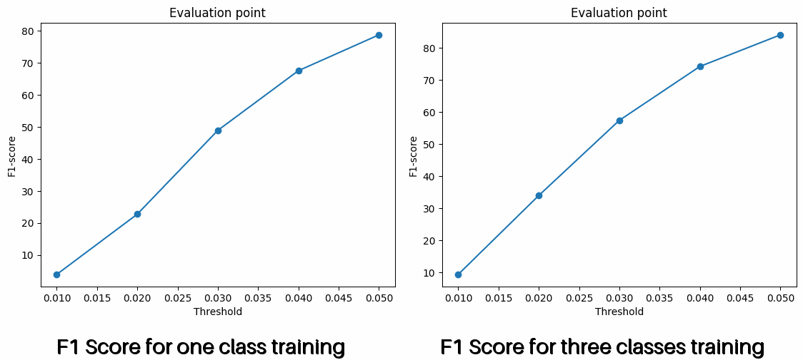

---