# Assignment 3 : Neural Volume Rendering and Surface Rendering

**Name:** Riu Cherdchusakulchai
**Andrew ID:** rcherdch

---

# A. Neural Volume Rendering (80 points)

## 0. Transmittance Calculation (10 points)

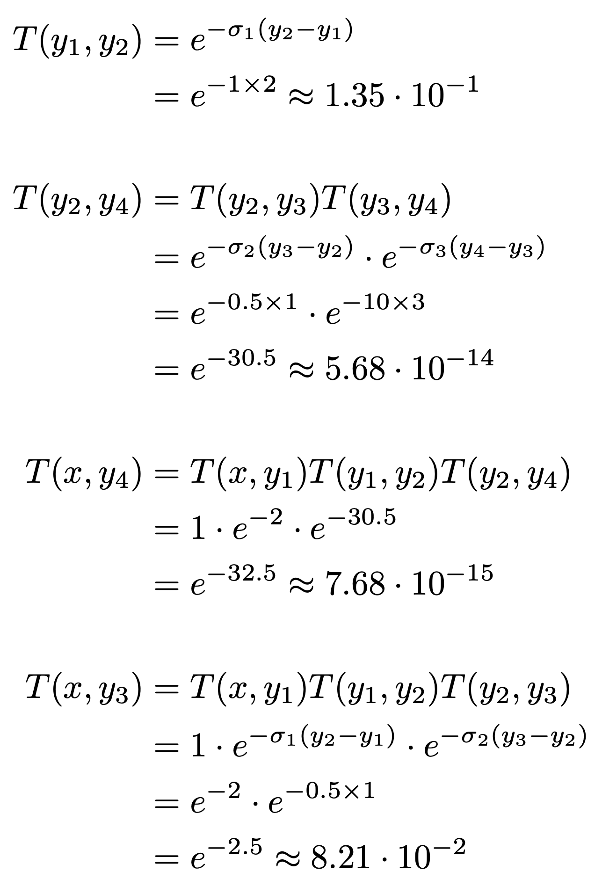

##  1. Differentiable Volume Rendering

##  1.3. Ray sampling (5 points)

xy_grid

rays

##  1.4. Point sampling (5 points)

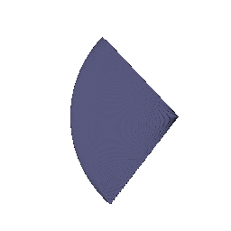

##  1.5. Volume rendering (20 points)

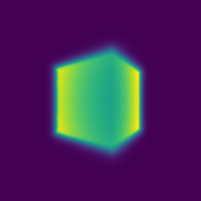

##  2. Optimizing a basic implicit volume

##  2.1. Random ray sampling (5 points)

##  2.2. Loss and training (5 points)

Center of the box: (0.25, 0.25, 0.00)

Side lengths of the box : (2.00, 1.50, 1.50)

##  2.3. Visualization

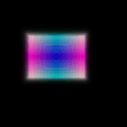

##  3. Optimizing a Neural Radiance Field (NeRF) (20 points)

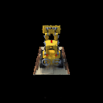

##  4. NeRF Extras (CHOOSE ONE! More than one is extra credit)

###  4.1 View Dependence (10 points)

Increasing view dependence allows the model to reproduce realistic, non-Lambertian effects like highlights and reflection. However, it makes the model prone to overfitting by memorizing the appearance from each training view instead of learning the true 3D shape.

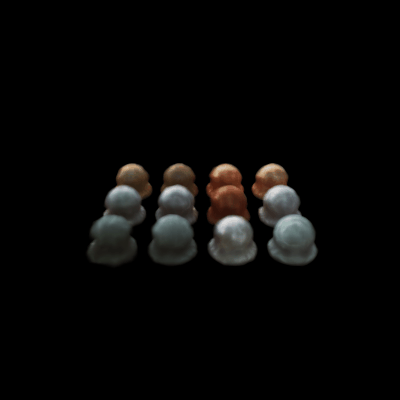

###  4.2 Coarse/Fine Sampling (10 points)

The coarse-to-fine method is slower because it requires two network passes per ray. However, this method is far more efficient than a single pass with a very large number of samples. By using the coarse network's output to create a probability distribution, the fine network can focus its limited sampling budget on high-density regions that actually contribute to the final color, enabling the NeRF to render sharp details and complex geometry.

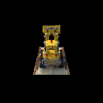

# B. Neural Surface Rendering (50 points)

##  5. Sphere Tracing (10 points)

This implementation finds where rays intersect a 3D surface by iteratively marching each ray forward from its origin. In each step, it queries the implicit_fn to get the distance from the ray's current point to the nearest surface. It then advances the point along its direction. This process repeats until the distance v is less than epsilon, indicating a hit, or until a maximum number of iterations is reached.

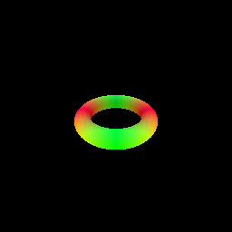

##  6. Optimizing a Neural SDF (15 points)

Input point cloud

Prediction 

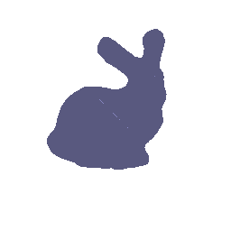

##  7. VolSDF (15 points)

alpha value of 5.0, 10.0, 20.0

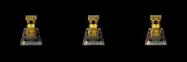

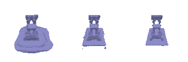

beta value of 0.05, 0.1 (Empty result for beta value of 0.01)

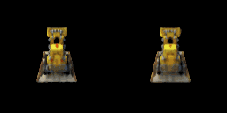

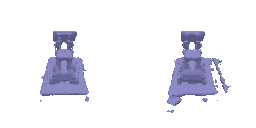

`alpha` is a density scaling parameter. It controls how opaque the interior of the object is.

`beta` is smoothness parameter. It controls how sharp or blurry the transition from empty space to the object's surface is.

1. How does high `beta` bias your learned SDF? What about low `beta`?

High beta biases the network to learn smooth, blob-like, and overly simple surfaces. Low beta biases the network to learn sharp, highly detailed, and accurate surfaces.

2. Would an SDF be easier to train with volume rendering and low `beta` or high `beta`? Why?

An SDF would be much easier to train with a high beta. With a low beta, the density is a very thin and sharp. In early training, when the SDF is randomly initialized, most ray samples will completely miss, resulting in zero density and zero gradient. With a high beta, the density field is foggy, so ray samples will surely hit some density, providing non-zero gradient for optimization.

3. Would you be more likely to learn an accurate surface with high `beta` or low `beta`? Why?

I would be more likely to learn an accurate surface with a low beta. A low beta model, while harder to train, forces accuracy. Because the density is so concentrated, the network must learn the precise SDF location to minimize the rendering loss.

## 8. Neural Surface Extras (CHOOSE ONE! More than one is extra credit)

### 8.1. Render a Large Scene with Sphere Tracing (10 points)

I render scene with multiple primitives including 2 boxes, 2 torus, and 1 sphere.

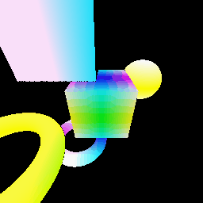

### 8.2 Fewer Training Views (10 points)

The VolSDF prediction, training with 100 views

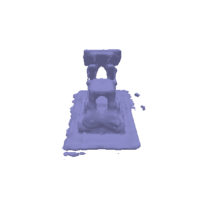

The VolSDF prediction, training with 20 views

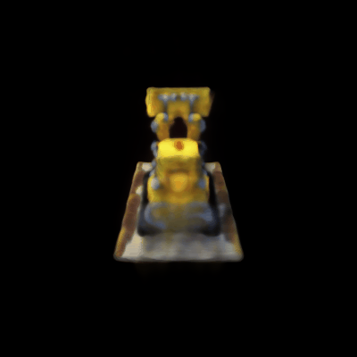

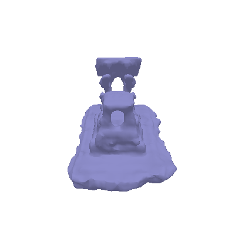

The NeRF prediction, training with 20 views

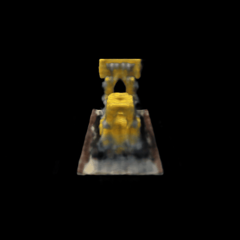

### 8.3 Alternate SDF to Density Conversions (10 points)

I experiemented with the logistic density distribution, presenting in Neus paper to convert SDF to density. The result shows that the Neus method is more prone to geometric noise and small holes, while the result from VolSDF method has more smooth surface.

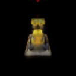

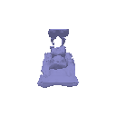
