# Assignment 4 

**Name:** Riu Cherdchusakulchai
**Andrew ID:** rcherdch

---

# 1. 3D Gaussian Splatting

## 1.1 3D Gaussian Rasterization (35 points)

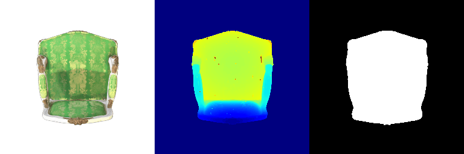

## 1.2 Training 3D Gaussian Representations (15 points)

Learning rates for each parameters

- Opacity: 0.05
- Scale: 0.005
- Color: 0.0025
- Mean: 0.00016

Iteration: 1000

Mean PSNR: 29.647
Mean SSIM: 0.940

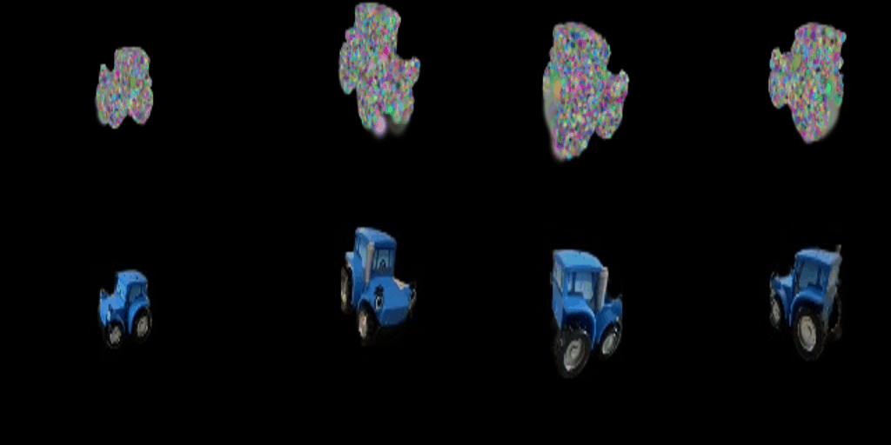

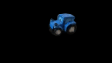

## 1.3 Extensions **(Choose at least one! More than one is extra credit)**

### 1.3.1 Rendering Using Spherical Harmonics (10 Points)

Without Spherical Harmonics

Using Spherical Harmonics

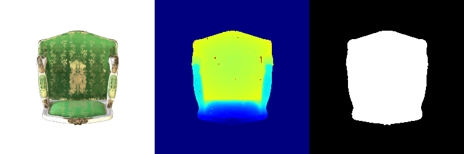

**Frame 3**

Without Spherical Harmonics

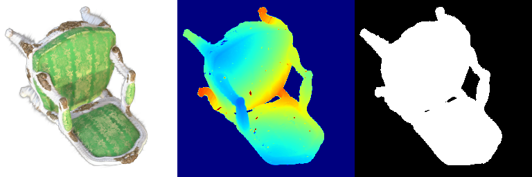

Using Spherical Harmonics

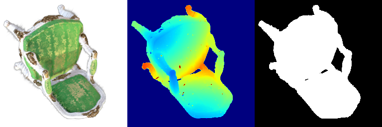

**Frame 13**

Without Spherical Harmonics

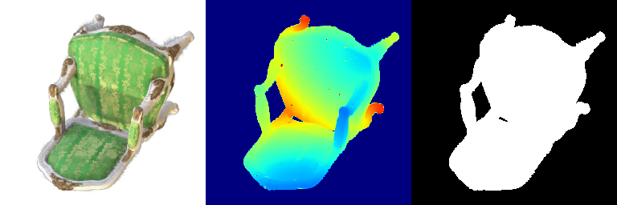

Using Spherical Harmonics

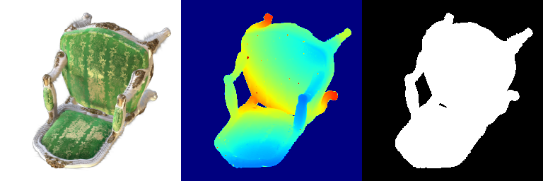

Incorporating spherical harmonics allows Gaussian splatting to model view-dependent effects, resulting in greater fidelity for complex lighting and specular highlights. These benefits are particularly prominent in areas with detailed shading, such as the cushions and armchairs.

### 1.3.2 Training On a Harder Scene (10 Points)

#### Baseline

Learning rates for each parameters

- Opacity: 0.05
- Scale: 0.005
- Color: 0.0025
- Mean: 0.00016
- Spherical Harmonics: 0.000125

Iteration: 1000

Mean PSNR: 17.227
Mean SSIM: 0.642

#### Improvement

Learning rates for each parameters

- Opacity: 0.05
- Scale: 0.005
- Color: 0.0025
- Mean: 0.00016
- Spherical Harmonics: 0.000125
- Quaternion: 0.001

Iteration: 10000

SSIM loss is added with a weight of 0.2 and isotropic is set to False

Mean PSNR: 20.512
Mean SSIM: 0.731

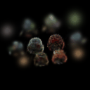

# 2. Diffusion-guided Optimization

## 2.1 SDS Loss + Image Optimization (20 points)

Prompt: "A standing corgi dog", trained for 2000 iterations

No guidance

With guidance

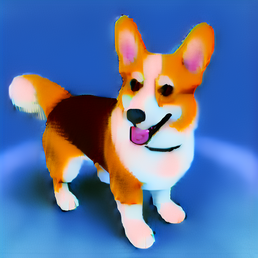

---

Prompt: "A hamburger", trained for 2000 iterations

No guidance

With guidance

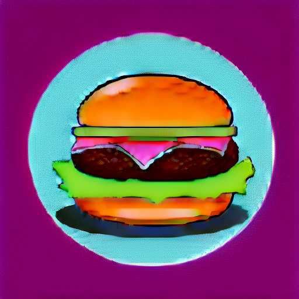

---

Prompt: "A gorilla wearing suit with sunglasses in minecraft theme", trained for 2000 iterations

No guidance

With guidance

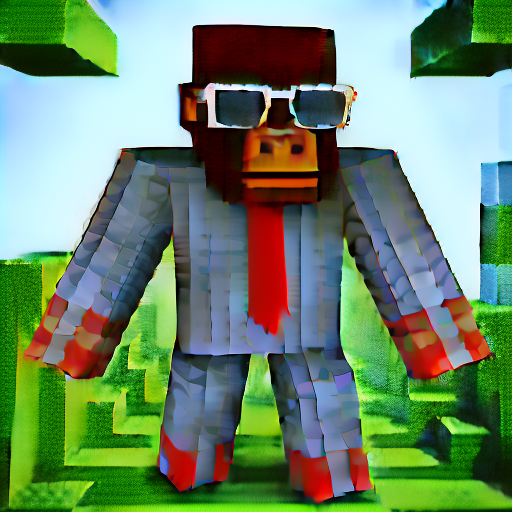

---

Prompt: "A orange shubby cat with a black strip holding sword", trained for 2000 iterations

No guidance

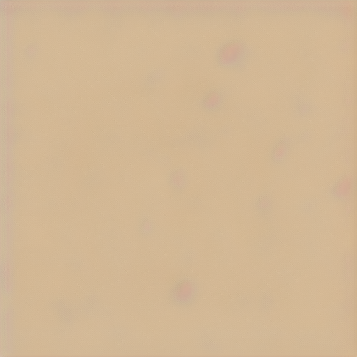

With guidance

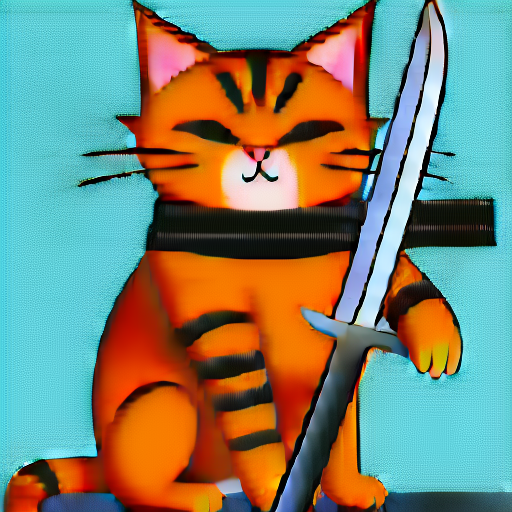

## 2.2 Texture Map Optimization for Mesh (15 points)

Prompt: A pink and yellow stripe cow

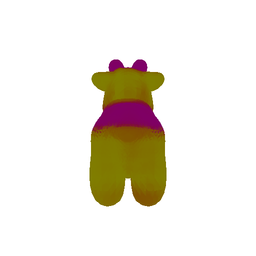

Prompt: A black and white cow

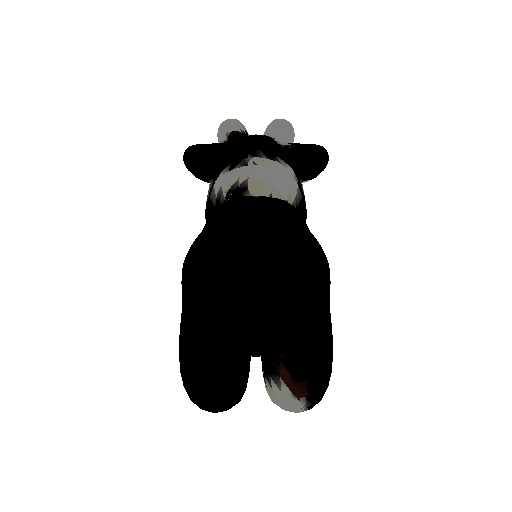

## 2.3 NeRF Optimization (15 points)

A standing corgi dog

A hamburger

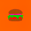

A hotdog

## 2.4 Extensions (Choose at least one! More than one is extra credit)

### 2.4.1 View-dependent text embedding (10 points)

A standing corgi dog

Without view dependence

Using view dependence

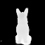

A hamburger

Without view dependence

Using view dependence

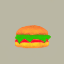

A hotdog

Without view dependence

Using view dependence

Previously, using just one generic prompt confused the model, causing the Janus problem where the detailed front view would weirdly repeat on the other side (like the corgi ears). View-dependent conditioning fixes this by explicitly telling the model what the sides and back should look like. 

