# Assignment 5 : Point Cloud Processing

**Name:** Riu Cherdchusakulchai
**Andrew ID:** rcherdch

---

## Q1. Classification Model (40 points)

### Test Accuracy: 97.90 %

### Correct Prediction

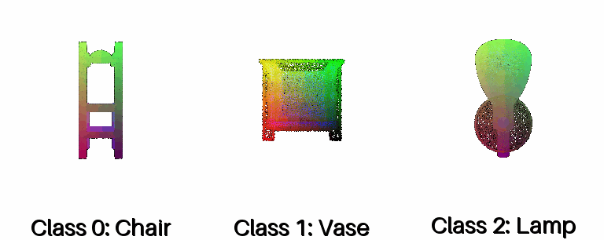

### Failure Prediction

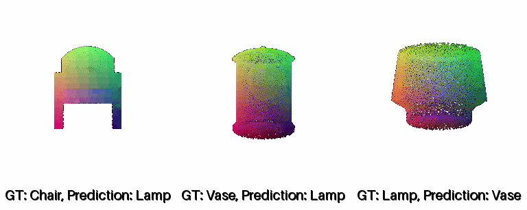

### Interpretation 

The model achieved a high test accuracy of 97.90%. The few mistakes show its main weak spots: it mistook a Chair for a Lamp, probably because the chair looked flat and its seat was hard to see, making it look like just a tall, skinny lamp. Furthermore, the model consistently confused Lamps and Vases, indicating a struggle to differentiate between classes that share similar geometric profiles. These errors suggest the model is less robust to ambiguous objects and objects with high inter-class similarity.

## Q2. Segmentation Model (40 points) 

### Test Accuracy: 90.20 %

### Good Prediction

Accuracy: 94.87 %

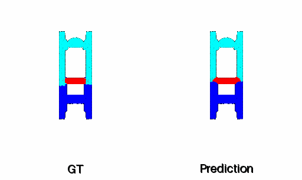

---

Accuracy: 98.80 %

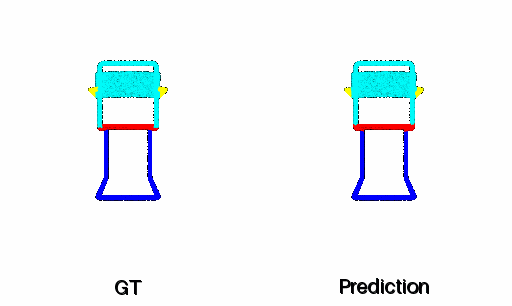

---

Accuracy: 89.83 %

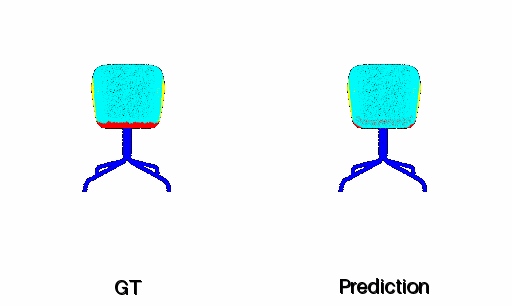

### Bad Prediction

Accuracy: 68.45 %

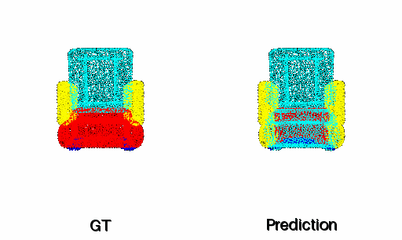

---

Accuracy: 48.24 %

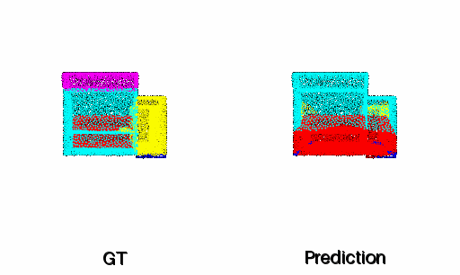

---

Accuracy: 66.32 %

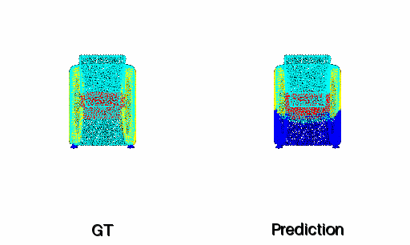

### Interpretation 

The model achieved a high test accuracy of 90.20%. The lower accuracy is due to samples that have an uncommon chair shape or that differ significantly from the training set.

## Q3. Robustness Analysis (20 points) 

### Classification - Rotation Analysis

---

Rotation: 45 degree

Accuracy: 55.72 %

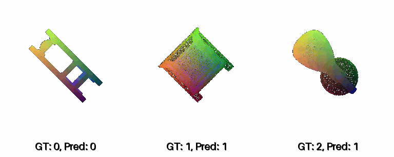

---

Rotation: 90 degree

Accuracy: 25.60 %

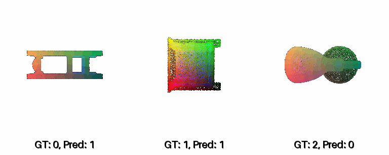

---

Rotation: 180 degree

Accuracy: 58.45 %

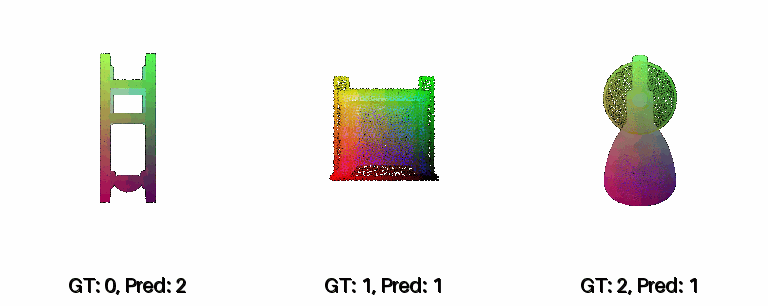

---

The model performs poorly when rotation is applied to the input data. This is expected because a component to ensure rotation invariance was not included in the model architecture. The lowest performance was observed in the 90-degree rotation experiment. This is likely because the objects in the dataset are typically stretched/elongated along one axis, and a 90-degree rotation causes them to differ most significantly from the original, unrotated training samples.

---

### Classification - Number of Points Analysis

---

Number of Points: 50

Accuracy: 86.88 %

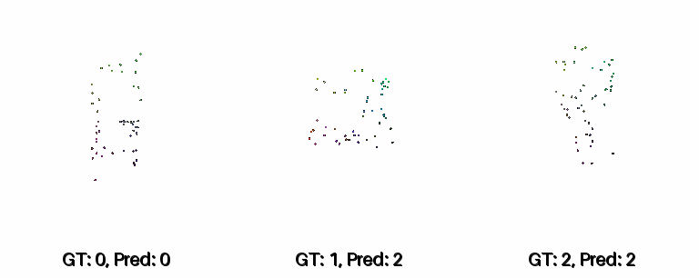

---

Number of Points: 100

Accuracy: 94.12 %

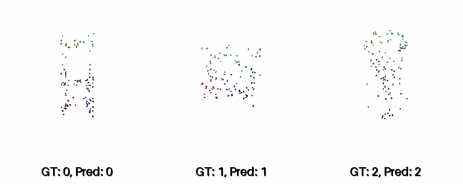

---

Number of Points: 1000

Accuracy: 97.17 %

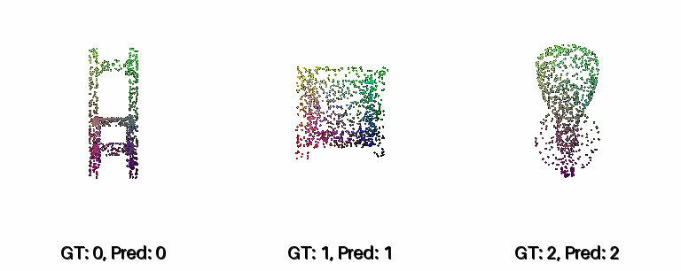

---

The model's performance dropped slightly when the number of points was decreased. This suggests that the model is robust, even with a reduced number of input points.

---

### Segmentation - Rotation Analysis

---

Rotation: 45 degree

Accuracy: 62.67 %

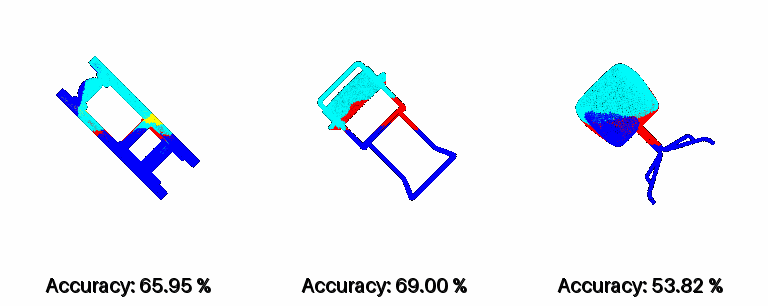

---

Rotation: 90 degree

Accuracy: 43.66 %

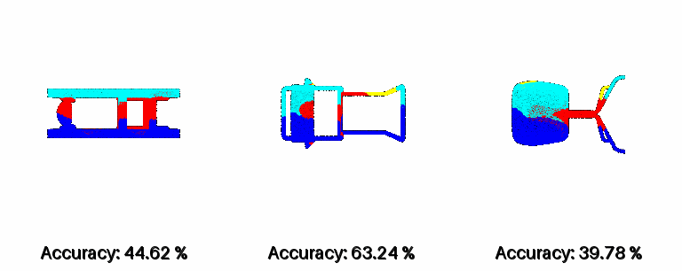

---

Rotation: 180 degree

Accuracy: 37.23 %

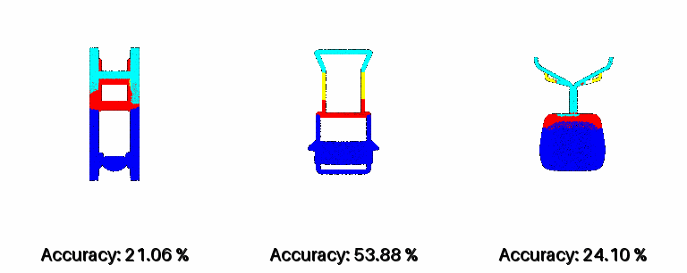

---

The results indicate that the model did not properly learn the individual parts of the chair. Instead, it seems to have memorized the relative positions of these parts based on the overall object orientation and level. The poorest performance was observed in the 180-degree rotation experiment, where it consistently predicted the top and bottom labels incorrectly.

---

### Segmentation - Number of Points Analysis

---

Number of Points: 50

Accuracy: 79.62 %

---

Number of Points: 100

Accuracy: 82.08 %

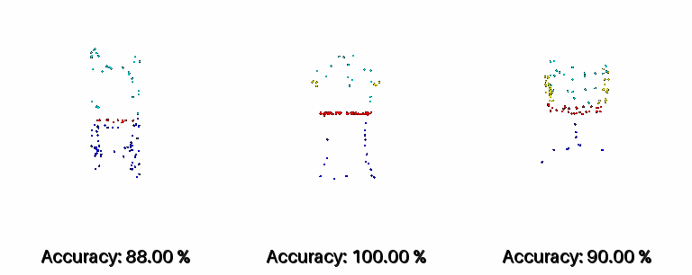

---

Number of Points: 1000

Accuracy: 89.97 %

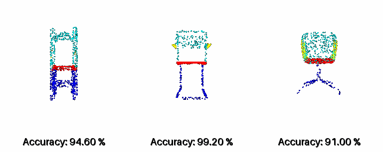

---

Number of Points: 5000

Accuracy: 90.21 %

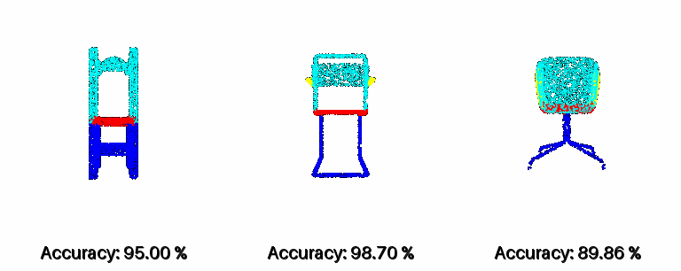

---

The model's performance dropped slightly when the number of points was decreased. This suggests that the model is robust, even with a reduced number of input points.

---

## Q4. Bonus Question - Locality (20 points)